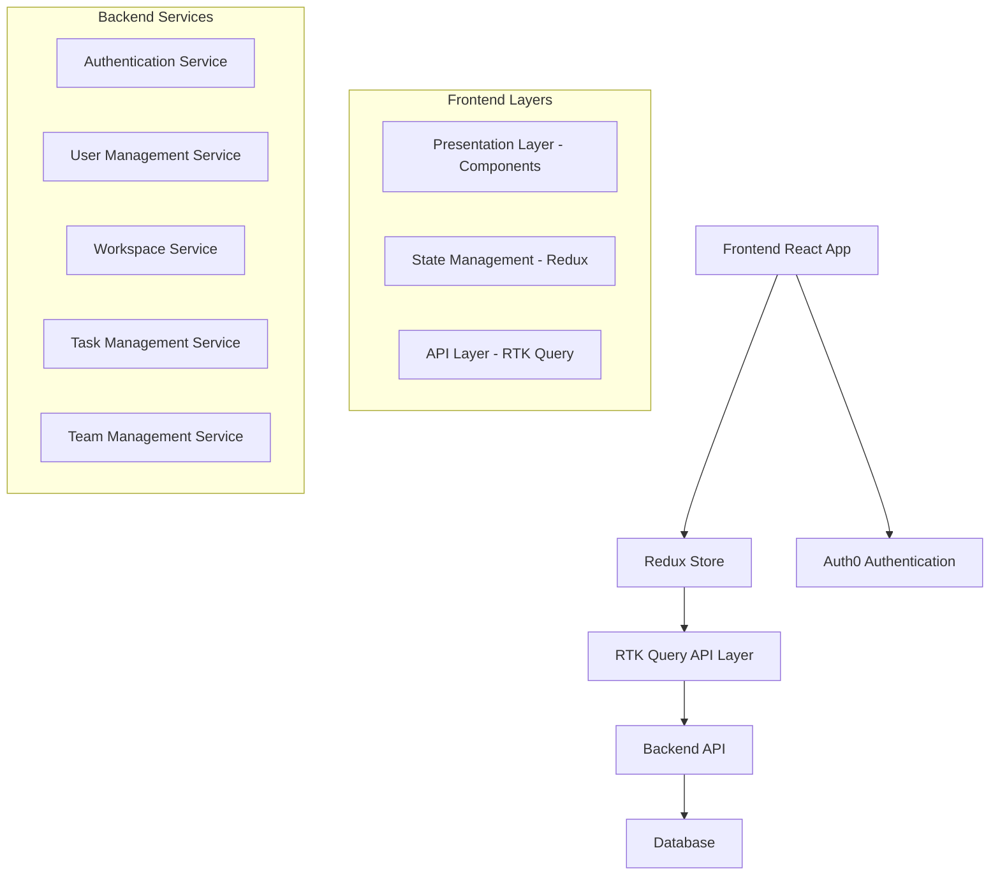
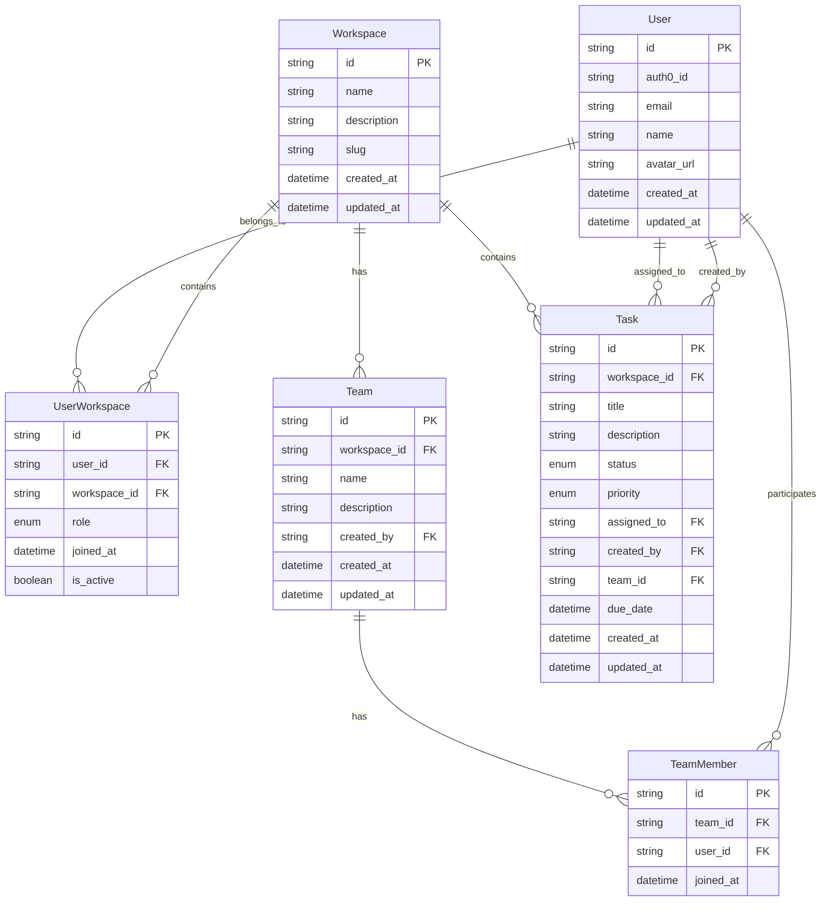

# Design Document

## Overview

The multi-tenant workspace system is designed as a scalable, secure task management platform that supports multiple isolated workspaces with role-based access control. The architecture follows modern React patterns with Redux Toolkit for state management, implementing a workspace-first approach where all data operations are scoped to the user's active workspace.

## Architecture

### High-Level Architecture



### Multi-Tenant Data Model



## Components and Interfaces

### Frontend Component Architecture

```
src/
├── components/
│   ├── workspace/
│   │   ├── WorkspaceSelector.tsx
│   │   ├── WorkspaceCreator.tsx
│   │   └── WorkspaceSettings.tsx
│   ├── team/
│   │   ├── TeamList.tsx
│   │   ├── TeamCreator.tsx
│   │   ├── TeamMemberManager.tsx
│   │   └── InviteUser.tsx
│   ├── task/
│   │   ├── TaskBoard.tsx
│   │   ├── TaskForm.tsx
│   │   ├── TaskItem.tsx
│   │   └── TaskAssignment.tsx
│   ├── user/
│   │   ├── UserProfile.tsx
│   │   ├── RoleManager.tsx
│   │   └── UserList.tsx
│   └── auth/
│       ├── AuthGuard.tsx
│       ├── RoleGuard.tsx
│       └── WorkspaceGuard.tsx
├── pages/
│   ├── Onboarding/
│   │   ├── WorkspaceSelection.tsx
│   │   └── WorkspaceCreation.tsx
│   ├── Dashboard/
│   │   └── WorkspaceDashboard.tsx
│   ├── Tasks/
│   │   └── TaskManagement.tsx
│   ├── Teams/
│   │   └── TeamManagement.tsx
│   └── Admin/
│       └── WorkspaceAdmin.tsx
├── redux/
│   ├── slices/
│   │   ├── authSlice.ts
│   │   ├── workspaceSlice.ts
│   │   ├── teamSlice.ts
│   │   ├── taskSlice.ts
│   │   └── userSlice.ts
│   └── api/
│       ├── authApi.ts
│       ├── workspaceApi.ts
│       ├── teamApi.ts
│       ├── taskApi.ts
│       └── userApi.ts
└── hooks/
    ├── useWorkspace.ts
    ├── usePermissions.ts
    └── useRoleGuard.ts
```

### Key Interfaces

```typescript
// Core Types
interface User {
  id: string;
  auth0Id: string;
  email: string;
  name: string;
  avatarUrl?: string;
  createdAt: string;
  updatedAt: string;
}

interface Workspace {
  id: string;
  name: string;
  description?: string;
  slug: string;
  createdAt: string;
  updatedAt: string;
}

interface UserWorkspace {
  id: string;
  userId: string;
  workspaceId: string;
  role: 'member' | 'supervisor' | 'admin';
  joinedAt: string;
  isActive: boolean;
  user?: User;
  workspace?: Workspace;
}

interface Team {
  id: string;
  workspaceId: string;
  name: string;
  description?: string;
  createdBy: string;
  members?: TeamMember[];
  createdAt: string;
  updatedAt: string;
}

interface Task {
  id: string;
  workspaceId: string;
  title: string;
  description: string;
  status: 'todo' | 'in_progress' | 'review' | 'completed';
  priority: 'low' | 'medium' | 'high' | 'urgent';
  assignedTo?: string;
  createdBy: string;
  teamId?: string;
  dueDate?: string;
  createdAt: string;
  updatedAt: string;
}

// Permission System
interface Permission {
  resource: 'task' | 'team' | 'user' | 'workspace';
  action: 'create' | 'read' | 'update' | 'delete' | 'assign';
  scope: 'own' | 'team' | 'workspace';
}

interface RolePermissions {
  member: Permission[];
  supervisor: Permission[];
  admin: Permission[];
}
```

## Data Models

### Redux State Structure

```typescript
interface RootState {
  auth: {
    user: User | null;
    isAuthenticated: boolean;
    isLoading: boolean;
  };
  workspace: {
    current: Workspace | null;
    userWorkspaces: UserWorkspace[];
    isLoading: boolean;
    error: string | null;
  };
  team: {
    teams: Team[];
    currentTeam: Team | null;
    members: TeamMember[];
    isLoading: boolean;
  };
  task: {
    tasks: Task[];
    filters: TaskFilters;
    isLoading: boolean;
  };
  user: {
    workspaceUsers: User[];
    permissions: Permission[];
    currentRole: 'member' | 'supervisor' | 'admin' | null;
  };
}
```

### API Endpoints Design

```typescript
// Authentication & User Sync
POST /api/auth/sync
GET /api/auth/me

// Workspace Management
GET /api/workspaces
POST /api/workspaces
GET /api/workspaces/:id
PUT /api/workspaces/:id
DELETE /api/workspaces/:id
POST /api/workspaces/:id/switch

// User & Role Management
GET /api/workspaces/:workspaceId/users
POST /api/workspaces/:workspaceId/users/invite
PUT /api/workspaces/:workspaceId/users/:userId/role
DELETE /api/workspaces/:workspaceId/users/:userId

// Team Management
GET /api/workspaces/:workspaceId/teams
POST /api/workspaces/:workspaceId/teams
PUT /api/workspaces/:workspaceId/teams/:teamId
DELETE /api/workspaces/:workspaceId/teams/:teamId
POST /api/workspaces/:workspaceId/teams/:teamId/members
DELETE /api/workspaces/:workspaceId/teams/:teamId/members/:userId

// Task Management
GET /api/workspaces/:workspaceId/tasks
POST /api/workspaces/:workspaceId/tasks
PUT /api/workspaces/:workspaceId/tasks/:taskId
DELETE /api/workspaces/:workspaceId/tasks/:taskId
PUT /api/workspaces/:workspaceId/tasks/:taskId/assign
```

## Error Handling

### Frontend Error Boundaries

```typescript
// Workspace-level error boundary
class WorkspaceErrorBoundary extends React.Component {
  // Handle workspace access errors
  // Redirect to workspace selection if needed
}

// Permission-level error boundary
class PermissionErrorBoundary extends React.Component {
  // Handle insufficient permission errors
  // Show appropriate error messages
}
```

### API Error Handling Strategy

```typescript
// Centralized error handling in RTK Query
const baseQueryWithErrorHandling = fetchBaseQuery({
  baseUrl: '/api',
  prepareHeaders: (headers, { getState }) => {
    // Add workspace context and auth headers
  },
});

// Custom error handling for different error types
const handleApiError = (error: FetchBaseQueryError) => {
  switch (error.status) {
    case 403:
      // Handle permission denied
      break;
    case 404:
      // Handle resource not found
      break;
    case 422:
      // Handle validation errors
      break;
  }
};
```

## Testing Strategy

### Unit Testing Approach

1. **Component Testing**
   - Test role-based rendering
   - Test workspace context switching
   - Test permission-based UI states

2. **Redux Testing**
   - Test workspace state management
   - Test role permission logic
   - Test API integration

3. **Hook Testing**
   - Test custom permission hooks
   - Test workspace context hooks

### Integration Testing

1. **User Flow Testing**
   - Complete onboarding flow
   - Workspace switching
   - Role-based task management

2. **Permission Testing**
   - Test all role combinations
   - Test cross-workspace isolation
   - Test unauthorized access prevention

### E2E Testing Scenarios

1. **Multi-tenant Isolation**
   - Verify data separation between workspaces
   - Test workspace switching doesn't leak data

2. **Role-based Access Control**
   - Test each role's capabilities
   - Test permission escalation prevention

3. **Team Collaboration**
   - Test team creation and management
   - Test task assignment and updates

## Security Considerations

### Authentication & Authorization

1. **JWT Token Management**
   - Secure token storage
   - Automatic token refresh
   - Workspace context in tokens

2. **Role-based Access Control**
   - Server-side permission validation
   - Client-side UI protection
   - API endpoint protection

3. **Data Isolation**
   - Workspace-scoped queries
   - Tenant isolation at database level
   - Cross-workspace access prevention

### Frontend Security

1. **Route Protection**
   - Workspace access guards
   - Role-based route protection
   - Unauthorized access handling

2. **Component Security**
   - Conditional rendering based on permissions
   - Secure state management
   - XSS prevention

## Performance Considerations

### State Management Optimization

1. **Selective Data Loading**
   - Load only current workspace data
   - Lazy load team and user data
   - Implement pagination for large datasets

2. **Caching Strategy**
   - Cache workspace data
   - Cache user permissions
   - Implement optimistic updates

### Component Optimization

1. **Code Splitting**
   - Lazy load workspace-specific components
   - Split by user roles
   - Dynamic imports for admin features

2. **Memoization**
   - Memoize permission calculations
   - Cache expensive computations
   - Optimize re-renders

## Deployment Architecture

### Environment Configuration

```typescript
// Environment-specific configurations
interface AppConfig {
  auth0: {
    domain: string;
    clientId: string;
    audience: string;
  };
  api: {
    baseUrl: string;
    timeout: number;
  };
  features: {
    multiWorkspace: boolean;
    teamManagement: boolean;
    advancedPermissions: boolean;
  };
}
```

### Monitoring & Analytics

1. **User Analytics**
   - Track workspace usage
   - Monitor role distribution
   - Measure feature adoption

2. **Performance Monitoring**
   - API response times
   - Component render performance
   - Error tracking and reporting

This design provides a solid foundation for implementing a scalable, secure multi-tenant task management system with comprehensive role-based access control.
